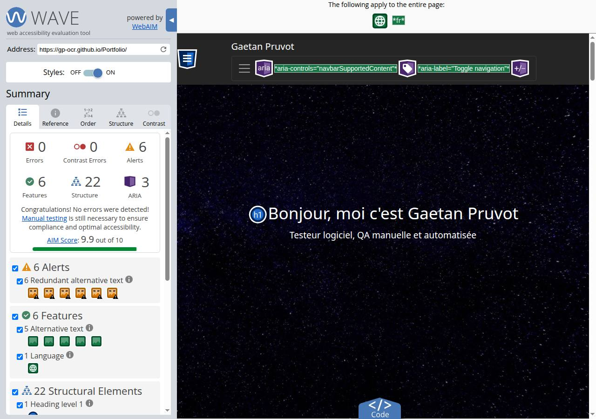

# Rapport WAVE

Page testée : https://gp-ocr.github.io/Portfolio/

Date du passage : 23 septembre 2026. Outil : WAVE en ligne, WebAIM.

Rapport d'origine : https://wave.webaim.org/report#/https://gp-ocr.github.io/Portfolio/

## Résumé

| Catégorie | Nombre |
|---|---|
| Erreurs | 0 |
| Erreurs de contraste | 0 |
| Alertes | 6 |
| Points positifs | 6 |
| Éléments de structure | 22 |
| ARIA | 3 |

Score AIM : 9,9 sur 10. WAVE ne signale aucune erreur.

## Les 6 alertes

Les six alertes sont du même type : texte alternatif redondant. Chaque image de compétence reprend le titre écrit juste en dessous. Le portrait et les quatre aperçus de projets ont un texte différent, WAVE les compte dans les points positifs.

## Ce que WAVE a reconnu

- 1 langue (français)
- 5 textes alternatifs
- 1 titre de niveau 1, 4 de niveau 2, 14 de niveau 3
- 2 listes, 1 navigation
- le bouton du menu : un libellé, un état ouvert ou fermé, un contrôle ARIA

## Capture

## Après ce passage

Les six alertes venaient des images de compétences : le texte alternatif répétait le titre écrit juste en dessous. Ces images ont maintenant un texte alternatif vide. Le titre reste dans le `h3`. Le portrait et les aperçus de projets gardent leur texte.

La page a aussi une balise `main` autour du contenu, et une icône `favicon.png` pour ne plus demander `favicon.ico` à la racine du domaine.
